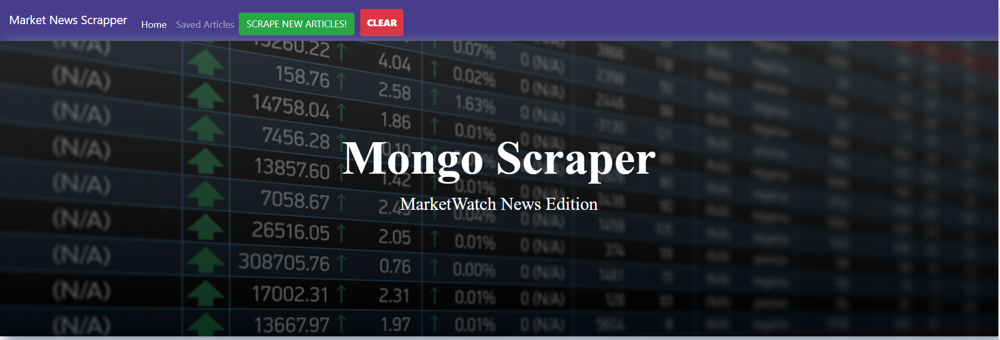

# Web Scrapper

### Overview
This is a web app that lets users view, save and delete articles and notes on the latest stock market news from [Marketwatch.com/markets](https://www.marketwatch.com/markets?mod=top_nav)

(1) __Scrape__ : _Scrape New Articles_ button when clicked scrapes latest articles from www.marketwatch.com/markets site and save the article details in MongoDB collection called 'articles'.

(2) __Clear__: _Clear_ button when clickrd removes all the articles loaded in the database.

(3) __Saved Articles__: _Saved Articles_ link loads a page with a list of articles marked as 'Save' by the user. 

(4)__Notes__: For each saved article user can write notes by clicking 'Article Notes' button. These notes are saved in database collection called 'notes'.

### Live Demo
[https://marketnews-scraper.herokuapp.com/](https://marketnews-scraper.herokuapp.com/)

### Technologies Used
* For Front-end : Bootstrap framework, handlebars template 
* For back-end : Node , Express, cheerio.js
  * npm packages used : express, express-handlebars, mongoose, cheerio, axios
* For Database : MongoDB , mongoose.js for schema validation

### Get Started
(1) To install the app clone this repository.

(2) Change directory to web_scraper

(3) Install node dependancies using command `npm install`

(4) Make sure your MongoDB server is running. 

(5) Start the app server using command `node server.js'

(6) If no environment variable $PORT is defined by default, the app will run at port=3000. 

(7) Open your browser and access the app at _http://localhost:3000_

